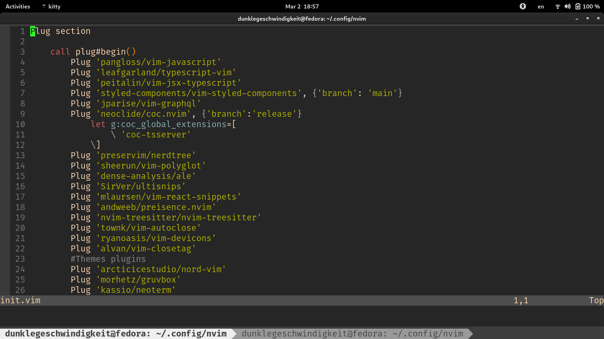

# My personal NEOVIM settings # 

[][neovim]

## [GruvBox colorscheme ](https://github.com/morhetz/gruvbox) ##

   

## Settings for React and Typescript ##

### Scripts ###

- Coc auto-recognize extension .(JSX, TSX, TS, JS)
     
    `autocmd BufEnter *.{js,jsx,ts,tsx} :syntax sync fromstart
	autocmd BufLeave *.{js,jsx,ts,tsx} :syntax sync clear
`

- [Coc configuration for eslint][coc-eslint]
     
  `if isdirectory('./node_modules')
	&& isdirectory('./node_modules/eslint')
		let g:coc_global_extensions += ['coc-eslint']
	endif`

- [Coc configuration for prettier][coc-prettier]
     
    `if isdirectory('./node_modules')
	&& isdirectory('./node_modules/prettier')
		let g:coc_global_extensions += ['coc-prettier']
	endif`
- [Coc typescript-server][coc-tsserver]
    `let g:coc_global_extensions = ['coc-tsserver']`

### Plugins ###

[][vim-javascript]
[][typescript-vim]
[][vim-jsx-typescript]
[][styled-components]
[][vim-graphql]
[][coc-vim]
[][vim-react-snippets]
[][vim-autoclose]
[][vim-autoclose-tag]

[neovim]: https://neovim.io
[coc-eslint]: https://github.com/neoclide/coc-prettier
[coc-prettier]: https://github.com/neoclide/coc-prettier
[coc-tsserver]: https://github.com/neoclide/coc-tsserver
[vim-javascript]: https://github.com/pangloss/vim-javascript
[typescript-vim]: https://github.com/leafgarland/typescript-vim
[vim-jsx-typescript]: https://github.com/peitalin/vim-jsx-typescript
[styled-components]: https://github.com/styled-components/vim-styled-components
[vim-graphql]: https://github.com/jparise/vim-graphql
[coc-vim]: https://github.com/neoclide/coc.nvim
[vim-react-snippets]: https://github.com/mlaursen/vim-react-snippets
[vim-autoclose]: https://github.com/Townk/vim-autoclose
[vim-autoclose-tag]: https://github.com/alvan/vim-closetag
